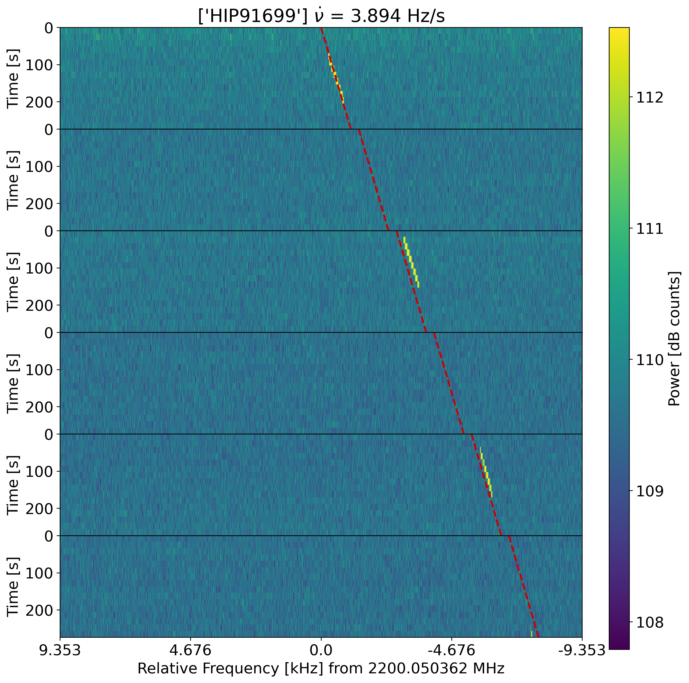
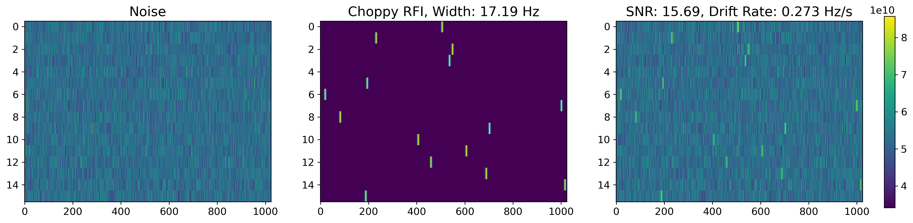
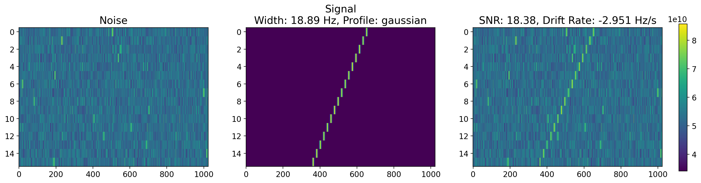
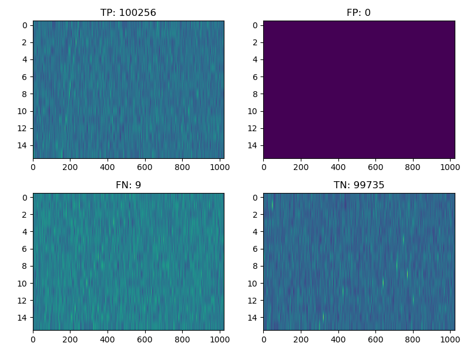
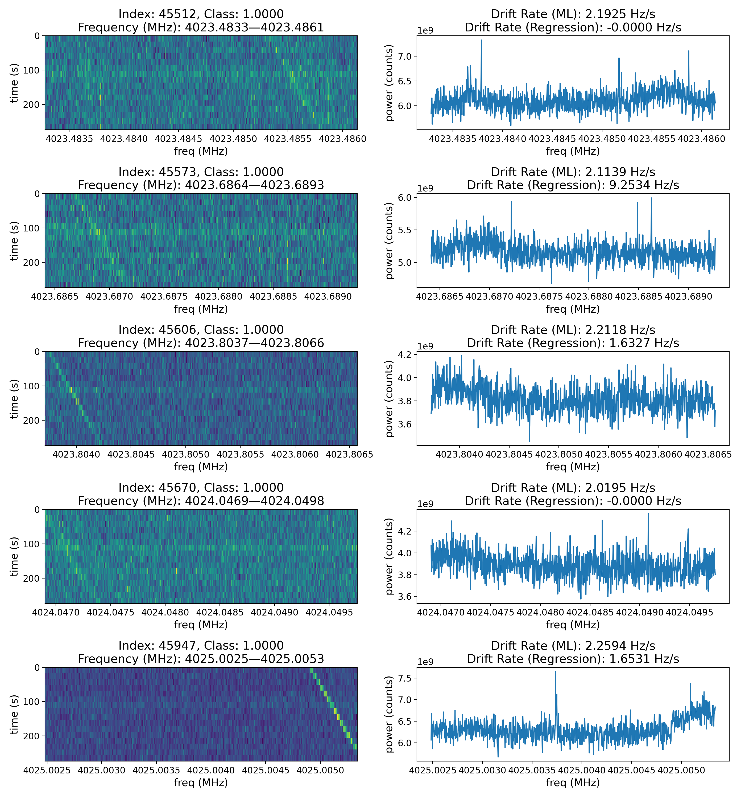

# turboSETI-ML
`turboSETI-ML` uses neural networks to detect narrowband drifting signals in filterbank or h5 files, outputting found signals to a `.csv` file along with their predicted drift rates.

## Introduction
The search for aliens is hard, but **Breakthrough Listen** is taking a crack at it, as the largest scientific program dedicated to the search for life beyond Earth.

One of the primary tools built for this purpose is `turboSETI` (https://github.com/UCBerkeleySETI/turbo_seti), which searches for narrowband drifting signals in frequency-time data gathered by radio telescopes. These signals typically span only a few Hz, but persist longer in time. Signals that originate far from Earth should exhibit a property known as Doppler drift, where the frequency of the signal appears to "drift" over time; the farther the signal source, the larger the drift rate. One example plot of narrowband signals discovered by `turboSETI` can be found below.

<p align="center">
    
</p>

This would be an ideal detection, as the signal is present only in the ON observations (first, third, and fifth arrays) when the telescope is pointed _at_ the source, and not present when the telescope is pointed _away_ from the source.

Currently, `turboSETI` is good at finding these signals, but it is not fast. On fine-resolution data from the Green Bank Telescope, where a file contains over 1.74 billion frequency channels to process, `turboSETI` takes approximately 9 hours to run on a 5-minute observation. `turboSETI-ML` aims to perform the same search function as `turboSETI` but at a faster rate.

---

## Dependencies
- python 3
- tensorflow 2.x
- scikit-learn, scikit-image
- numpy, scipy, pandas, matplotlib
- numba (for vast speed optimizations, trust me!)
- astropy
- blimpy (https://github.com/UCBerkeleySETI/blimpy)
- setigen (https://github.com/bbrzycki/setigen)

---

## Usage
There are 3 main steps in the workflow of this code:

1. Generate a training dataset by sampling from a bunch of filterbank/h5 files.
2. Create and train the ML model.
3. Predict using that model on some fil/h5 file.

### Generating the dataset (`generate_dataset.py`)
To create the training set, we need a path to `.fil` or `.h5` files. These files will be split up, and each frequency chunk will be sampled to find parameters for a chi-squared distribution that will be used to generate reasonable noisy backgrounds for training. These parameters will be saved to an `.npz` file.

This can be done with the following code:

```
python3 generate_dataset.py /mnt_blpd12/datax/GC/AGBT19B_999_06/*0000.fil -total 100000 -spf 1000 -fs 17e6 -max_time 3600 --save_name train_params.npz
```

This code takes samples all files matching the pattern `/mnt_blpd12/datax/GC/AGBT19B_999_06/*0000.fil`. It will take a total of 100,000 means, stddevs, and mins from the files, taking 1000 samples from each file in the path. Sampled arrays are separated by 17 million frequency channels, set by the `-fs` flag. The final `.npz` is saved to `train_params.npz`.

**NOTE:** The program will **duplicate** the sampled parameters until there are `-total` samples if one of the following conditions is met:

1. The amount of time the program has taken exceeds `-max_time` seconds(in this case, 3600 seconds/1 hour).
2. The program runs out of files to sample, which occurs when `-spf` or `--samples_per_file` is too small, `-fs` or `--f_shift` is too large, or if there are simply too few files to sample from.

More details can be found by running the `-h` flag.

### Training the model (`create_model.py`)
To train a new model, we first need to pass in an `.npz` file of parameter distributions created by `generate_dataset.py` using the `-l` or `--load_training` flags.

For every sample, the program takes a parameter and simulates one noisy array, labeling it as "no signal." It then uses `setigen` to inject an artificial signal into the array, labeling this new array as containing a "signal."

Below is what would a noisy background with _no signal_ would look like.

<p align="center">
    
</p>

And here's the same noise with an injected signal.

<p align="center">
    
</p>

You can choose various neural network parameters, such as the number of convolutional layers, via flags like `-conv`. You can also change the shape of the simulated array with `--fchans` (columns = frequency channels) and `--tchans` (rows = time channels). Many other controllable parameters are listed when running `--help`.

A full command would look something like the following:

```
python3 create_model.py -l train_params.npz -f 1024 -t 16 -conv 4 -samp 200000 -e 100 --save_model best_model.h5 --confusion_matrix best_confusion_matrix.png -cores 4
```

This would load in our previously created `train_params.npz` and simulate 200,000 *pairs* of arrays, each array having 1024 frequency channels (columns) and 16 time integrations (rows).

**IMPORTANT!!!** The `-samp` / `--num_samples` argument tells the program how many *pairs* of arrays to simulate (one array with signal, one without). So, the above command generates 200,000 arrays with signal, and 200,000 without, for a total of 400,000 training arrays! This is an important consideration for memory purposes!

The program then takes these examples and trains a model with 4 convolutional layers for 100 epochs at maximum—the program stops training early if validation loss doesn't decrease for a certain number of epochs.

The best model, the one that minmizes validation loss, is saved to `best_model.h5`.

A confusion matrix is optionally saved to `best_confusion_matrix.png`, showing the lowest confidence predictions for each category (True Positive, False Positive, True Negative, False Negative), or a blank array if there were no arrays from the validation set that ended up in the category. If applicable, there should be signals in the True Positive and False Negative positions, and conversely, no signals in the False Positive and True Negative positions.

<p align="center">
    
</p>

In the confusion matrix above, the lack of any image in the False Positive (FP) area and `FP: 0` at the top of the subplot indicate there were no arrays in the validation set that the model thought contained a signal when it actually didn't. The signal in the True Positive (TP) area is very faint, which makes sense that the model predicted it as containing a signal with low confidence. Can you spot the signal in the False Negative (FN) array?

Multiple cores are supported, and encouraged when possible, to simulate the training set. This is set by `-cores <num_cores>`, which in this instance is allowing 4 cores to run in parallel when creating the training data.

Once the model has been trained, we can move on to finding new signals!

### Prediction

Prediction requires two paths, one to the candidate file and the other to the model file. From there, we can save a CSV file containing the frequencies of model-predicted signals usin the `-csv` flag. Since some filterbank files, especially fine-resolution files, are exceptionally large (over 100 GB!), it's important to set the maximum amount of memory that can be used to load in a file at once (default 1GB).

Example usage of `predict.py` can be found below:

```
python3 predict.py /mnt_blpd12/datax/GC/AGBT19B_999_06/spliced_blc00010203040506o7o0111213141516o7o0212223242526o7o031323334353637_guppi_58705_13293_BLGCsurvey_Cband_C10_0057.gpuspec.0000.fil best_model.h5 -mem 20 -csv GBT_58705_14221_predictions.csv -cores 10
```

In the above command, we let our previously trained model, `best_model.h5`, run through the filterbank file 20 GB at a time, as set by `-mem 20`. Predictions are then saved to `GBT_58705_14221_predictions.csv`.

Like `create_model.py`, it is highly encouraged to use multiple cores whenever possible, again set by the `-cores` flag, but the defaut is to use a single core. In instances with many detected signals, computing drift rates on one core takes exceedingly long, thus bottlenecking the whole prediction script.

The following are __real__ signals detected by the model.

<p align="center">
    
</p>

---
## Future Work
- Pass in multiple files to predict in parallel. Would be especially good for Parkes multibeam data.
- Refine model to work better variable-shaped images arrays.
- Rewrite `multiprocessing` code to consume less memory when predicting.
---
## References
`turboSETI`: Enriquez, E., & Price, D. 2019, ascl, ascl (https://github.com/UCBerkeleySETI/turbo_seti)
